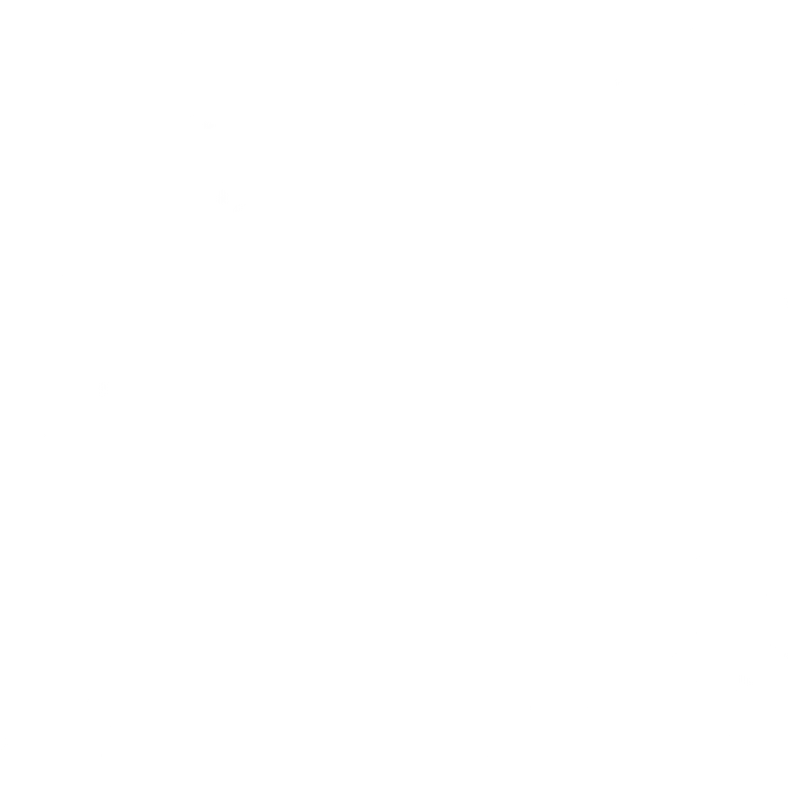

  
    🇺🇸 <a href="README.md">English</a> | 🇧🇷 Português    
  

## ✨ Bem-vindo(a) ao meu Portfólio!
Aqui você encontrará projetos de desenvolvimento de software baseados em automação de tarefas, treinamento de memória, jogos e puzzles.

 

## 📝 Sobre mim
Sou Engenheiro de Controle e Automação e gosto de aprender novas tecnologias e tornar ideias em projetos reais.

Meus interesses incluem:
- 🤖 Automação
- 👨🏻‍💻 Programação
- 🎯 Visão Computacional
- 🌌 Astronomia
- 🧠 Técnicas de Memória
- 🧩 Resolução de Puzzles

 

## 🚀 Projects

<table>
  <tr>
    <td width="800" valign="top">
      <h3>🧠 Mind Academy</h3>
      

        Um lugar onde você pode aperfeiçoar seus conhecimentos e habilidades de memória através de eventos especializados.                                      
      

        <strong>Principais recursos:</strong>
      <ul>
        <li>10+ categorias</li>
        <li>Customizável</li>
        <li>Estatísticas dos treinos</li>
        <li>Design responsivo</li>
      </ul>
      

        <strong>Tecnologias:</strong>
        <code>Vercel</code>
        <code>Next.js</code>
        <code>React</code>
        <code>TypeScript</code>
        <code>Tailwind CSS</code>
      

      

        <strong>Links:</strong>
        <a href="https://mindacademy.vercel.app/">Confira</a> | <a href="https://github.com/tmallmann/v0-memory">Documentação</a>
      

    </td>
    <td width="250" align="center" valign="middle">
      
    </td>
  </tr>
</table>

<table>
  <tr>
    <td width="800" valign="top">
      <h3>📜 Algs Database</h3>
      

        Domine o Cubo Mágico com algoritmos e ferramentas para a prática de speedcubing e resolução com os olhos vendados.
      

        <strong>Key features:</strong>
      <ul>
        <li>Algoritmos CFOP para 3x3 e 4x4</li>
        <li>Casos rotacionados</li>
        <li>Modalidade vendado</li>
        <li>Cronômetro com estatísticas</li>
      </ul>
      

        <strong>Tech stack:</strong>
        <code>Vercel</code>
        <code>Next.js</code>
        <code>React</code>
        <code>TypeScript</code>
        <code>Tailwind CSS</code>
      

      

        <strong>Links:</strong>
        <a href="https://v0-algs-database.vercel.app/">Confira</a> | <a href="https://github.com/tmallmann/v0-rubiks-cube-hub">Documentação</a>
      

    </td>    
    <td width="250" align="center" valign="middle">
      
    </td>
  </tr>
</table>

<table>
  <tr>
    <td width="800" valign="top">
      <h3>🧩 Tiles Puzzl.</h3>
      

        O clássico jogo 15-puzzle de blocos deslizantes que te desafia a organizar os números na ordem correta.
      

        <strong>Principais recursos:</strong>
      <ul>
        <li>Dimensões customizáveis</li>
        <li>Cores e temas customizáveis</li>
        <li>Estatísticas dos treinos</li>
        <li>Design responsivo</li>
      </ul>
      

        <strong>Tecnologias:</strong>
        <code>Vercel</code>
        <code>Next.js</code>
        <code>React</code>
        <code>TypeScript</code>
        <code>Tailwind CSS</code>
      

      

        <strong>Links:</strong>
        <a href="https://tiles-puzzl.vercel.app/">Confira</a> | <a href="https://github.com/tmallmann/v0-sliding-puzzle-game">Documentação</a>
      

    </td>
    <td width="250" align="center" valign="middle">
      
    </td>
  </tr>
</table>

 
