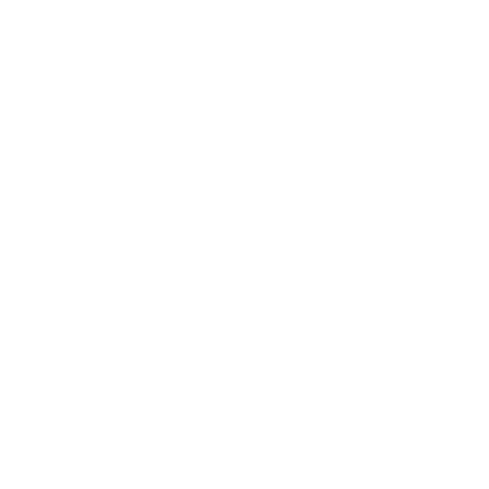

  
    🇺🇸 English | 🇧🇷 <a href="README-pt.md">Português</a>
  

## ✨ Welcome to my Portfolio!
Here you will find software development projects focused on task automation, memory training, games and puzzles.

 

## 📝 About me
I'm a Control and Automation Engineer and I enjoy learning new technologies and turning ideas into real-world projects.

My interests include:
- 🤖 Automation
- 👨🏻‍💻 Programming
- 🎯 Computer Vision
- 🌌 Astronomy
- 🧠 Memory Techniques
- 🧩 Puzzle Solving

 

## 🚀 Projects

<table>
  <tr>
    <td width="800" valign="top">
      <h3>🧠 Mind Academy</h3>
      

        A place where you can enhance your knowledge and memory skills with specialized training events.                                        
      

        <strong>Key features:</strong>
      <ul>
        <li>10+ categories </li>
        <li>Customizable</li>
        <li>Training statistics</li>
        <li>Responsive design</li>
      </ul>
      

        <strong>Tech stack:</strong>
        <code>Vercel</code>
        <code>Next.js</code>
        <code>React</code>
        <code>TypeScript</code>
        <code>Tailwind CSS</code>
      

      

        <strong>Links:</strong>
        <a href="https://mindacademy.vercel.app/">Check it out</a> | <a href="https://github.com/tmallmann/v0-memory">Documentation</a>
      

    </td>    
    <td width="250" align="center" valign="middle">
      
    </td>
  </tr>
</table>

<table>
  <tr>
    <td width="800" valign="top">
      <h3>📜 Algs Database</h3>
      

        Master the Rubik's Cube with comprehensive algorithm collections and practice tools for speedcubing and blindfolded solving.                                        
      

        <strong>Key features:</strong>
      <ul>
        <li>3x3 and 4x4 CFOP algorithms </li>
        <li>Rotated cases</li>
        <li>Blindfolded method</li>
        <li>Speedcubing Timer with statistics</li>
      </ul>
      

        <strong>Tech stack:</strong>
        <code>Vercel</code>
        <code>Next.js</code>
        <code>React</code>
        <code>TypeScript</code>
        <code>Tailwind CSS</code>
      

      

        <strong>Links:</strong>
        <a href="https://v0-algs-database.vercel.app/">Check it out</a> | <a href="https://github.com/tmallmann/v0-rubiks-cube-hub">Documentation</a>
      

    </td>    
    <td width="250" align="center" valign="middle">
      
    </td>
  </tr>
</table>

<table>
  <tr>
    <td width= 800" valign="top">
      <h3>🧩 Tiles Puzzl.</h3>
      

        The classic 15-tiles sliding puzzle that challenges you to place the tiles in the correct sequence.
      

        <strong>Key features:</strong>
      <ul>
        <li>Customizable grid size</li>
        <li>Customizable tile colors and themes</li>
        <li>Training statistics</li>
        <li>Responsive design</li>
      </ul>
      

        <strong>Tech stack:</strong>
        <code>Vercel</code>
        <code>Next.js</code>
        <code>React</code>
        <code>TypeScript</code>
        <code>Tailwind CSS</code>
      

      

        <strong>Links:</strong>
        <a href="https://tiles-puzzl.vercel.app/">Check it out</a> | <a href="https://github.com/tmallmann/v0-sliding-puzzle-game">Documentation</a>
      

    </td>
    <td width="250" align="center" valign="middle">
      
    </td>
  </tr>
</table>

 
